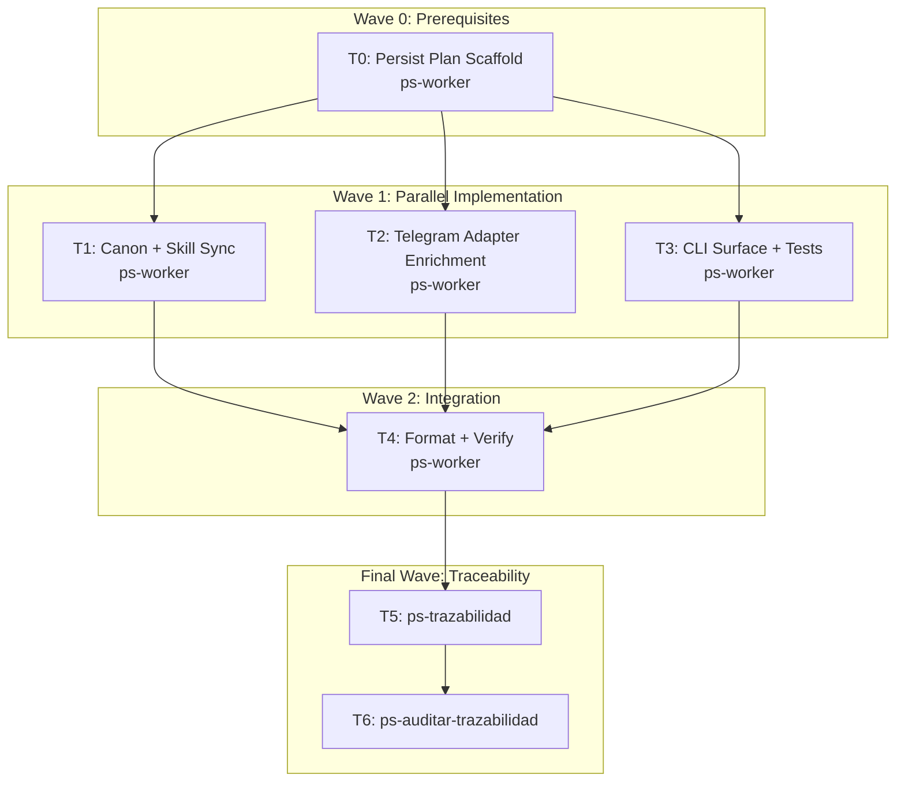

# Adjuntos y Botones Inline Implementation Plan

**Goal:** Extender `mi-telegram-cli` para observar adjuntos y botones inline en `messages read|wait` y accionar botones inline con `messages press-button`.

**Architecture:** La implementación enriquece el read model de Telegram en `internal/tg`, propaga la nueva forma pública a `internal/app` y `cmd/mi-telegram-cli`, y sincroniza canon técnico/funcional más la skill repo-local. La ejecución de botones queda limitada a callbacks reales y URLs informadas, sin abrir UI externa ni descargar adjuntos.

**Tech Stack:** Go, gotd/td, flag-based CLI, wiki canónica `.docs/wiki/01-09`, skill repo-local `skills/mi-telegram-cli`.

**Context Source:** `ps-contexto` y revisión manual del canon `.docs/wiki/01-09` confirmaron que el contrato vigente solo cubría `messages read|send|wait`, que `MensajeResumen` era el punto correcto para exponer metadata derivada, y que el riesgo principal era seguir asumiendo taps genéricos o `callback_query` en vez de un comando explícito y tipado.

**Runtime:** Codex

**Available Agents:**
- `ps-worker` — ejecución general de archivos, docs, shell y cambios operativos.
- `ps-explorer` — exploración read-only de código y documentación.
- `ps-qa` — auditoría de calidad, seguridad y cobertura de pruebas.

**Initial Assumptions:** gotd expone suficiente metadata de media y reply markup para resumir adjuntos y botones sin persistencia nueva. El primer release no descarga adjuntos ni ejecuta WebView, request-phone, request-geo o callbacks con SRP. La sincronización de la mirror externa no aplica mientras no se reinstale la skill global.

---

## Risks & Assumptions

**Assumptions needing validation:**
- `message-id` puede resolverse de forma exacta vía `messages.getMessages` o `channels.getMessages`; validar con tests sobre peers de canal y no canal.
- Los labels de botones inline son suficientemente estables para admitir `--button-text` como fallback; validar ambiguedad con error tipado.

**Known risks:**
- Drift entre código y canon al agregar una nueva superficie CLI. Mitigación: actualizar `03/04/06/07/09` en la misma tarea.
- Clasificación incompleta de media o botones. Mitigación: normalizar a `unsupported` y agregar tests sobre los helpers de resumen.

**Unknowns:**
- Qué variantes de media aparecen más seguido en bots reales. Plan: resumir un set amplio y dejar `unsupported` para el resto.
- Qué flows de skill dependían de taps implícitos. Plan: actualizar `SKILL.md`, `quickstart` y `recipes` para usar `buttons[].index` + `messages press-button`.

---

## Wave Dispatch Map

| Task | Wave | Agent | Subdoc | Done When |
|------|------|-------|--------|-----------|
| T0 | 0 | ps-worker | `./2026-04-14-mi-telegram-cli-adjuntos-botones/T0-setup.md` | `.docs/raw/plans/...` existe |
| T1 | 1 | ps-worker | `./2026-04-14-mi-telegram-cli-adjuntos-botones/T1-canon-skill-sync.md` | canon y skill describen `attachments[]`, `buttons[]` y `messages press-button` |
| T2 | 1 | ps-worker | `./2026-04-14-mi-telegram-cli-adjuntos-botones/T2-telegram-adapter.md` | `internal/tg` resume media/botones y puede accionar callbacks |
| T3 | 1 | ps-worker | `./2026-04-14-mi-telegram-cli-adjuntos-botones/T3-cli-surface-tests.md` | executor, help y tests cubren `messages press-button` |
| T4 | 2 | ps-worker | `./2026-04-14-mi-telegram-cli-adjuntos-botones/T4-format-verify.md` | `go test ./...` exits 0 |
| T5 | F | — | inline | `ps-trazabilidad` cierra RF/FL/TP/CT/skill |
| T6 | F | — | inline | `ps-auditar-trazabilidad` no detecta drift crítico |

## Final Wave: Traceability Closure

**Task T5: Run ps-trazabilidad**
- Clasificar el cambio como ampliación de contrato CLI con impacto funcional y técnico.
- Verificar sincronía entre `FL-MSG-05`, `RF-MSG-005`, `TP-MSG-*`, `CT-CLI-COMMANDS`, `TECH-SKILL-INTEGRATION` y la implementación Go.

**Task T6: Run ps-auditar-trazabilidad**
- Auditar consistencia read-only entre canon, skill repo-local y tests.
- Si aparece drift, volver a Wave 1 o Wave 2 antes de cerrar.
