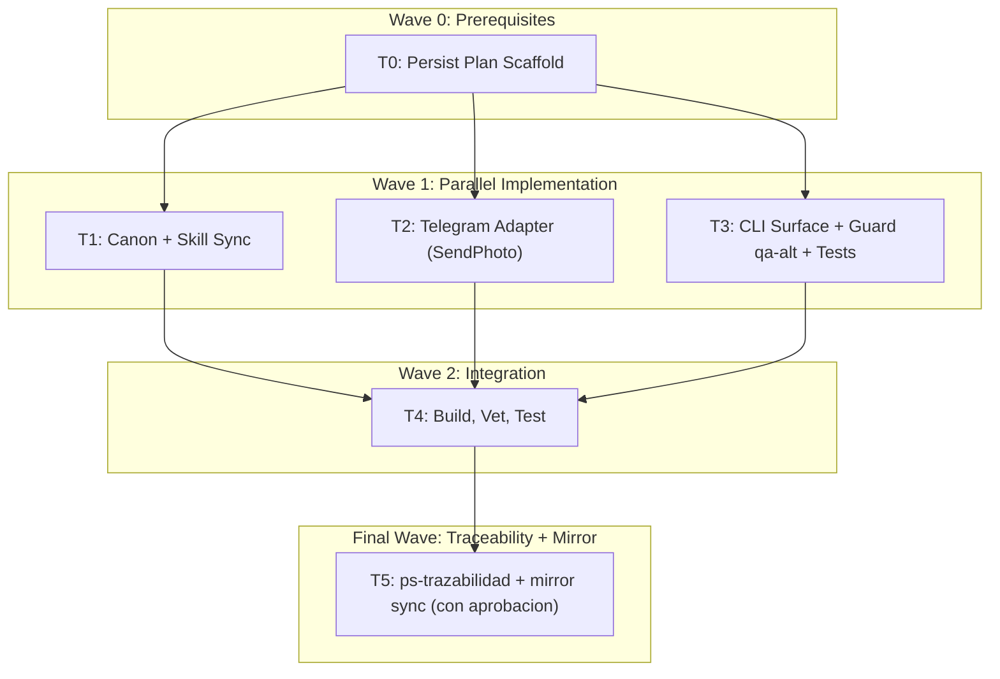

# Send Photo Implementation Plan

**Goal:** Extender `mi-telegram-cli` para enviar imagenes locales (`messages send-photo`) hacia un peer arbitrario, e introducir el guard `qa-alt` que bloquea automatizacion sobre el perfil real.

**Architecture:** Nuevo subcomando hermano de `messages send`. La capa `internal/tg` gana `SendPhoto` implementado con `gotd/td/telegram/uploader` + `tg.MessagesSendMediaRequest{InputMediaUploadedPhoto}`. La capa `internal/app` valida el archivo localmente (existencia, extension permitida `jpg|jpeg|png|webp`, cap 10 MiB, SHA256), llama al adapter, y devuelve `data.media{}` sin filtrar el filePath original. Un guard centralizado en `executor.go` aplica una **whitelist de subcomandos read-only** que pueden tocar `qa-alt`; cualquier otro subcomando con `--profile qa-alt` falla con `ProfileProtected`.

**Tech Stack:** Go 1.22+, `github.com/gotd/td v0.141.0`, flag-based CLI, wiki canonica `.docs/wiki/01-09`, skill repo-local `skills/mi-telegram-cli`.

**Context Source:** `ps-contexto` + 3 explorers paralelos confirmaron que (a) no existe upload de media en el repo aun, (b) no existe guard `qa-alt` hoy, (c) el patron `executeSend` + `withProfileLock` + `mapTelegramUnauthorizedOr` es reutilizable, y (d) el unpack de `MessageID`/`Date` ya funciona para `MessagesSendMedia`.

**Runtime:** Claude Code

**Available Agents:**
- ejecucion directa por el agente principal (sin delegar a workers especificos en este plan).

**Initial Assumptions:** gotd v0.141 acepta `uploader.NewUploader(api).FromPath(...)` y `api.MessagesSendMedia(...)`; el limit Telegram para `InputMediaUploadedPhoto` es 10 MiB; `RandomID` puede ser `crypto/rand` int64; el Updates devuelto soporta `unpack.MessageID` y `unpack.Message`. La sincronizacion de la mirror externa (`C:\repos\buho\assets\skills\mi-telegram-cli` y bin) requiere aprobacion fuera del workspace y se gestiona como T5.

---

## Risks & Assumptions

**Assumptions needing validation:**
- `RandomID` debe ser unique por request: usar `crypto/rand` y `binary.LittleEndian.Uint64` para evitar colisiones determinsticas en tests con `Now` fijo.
- La extension `.webp` se acepta como photo en Telegram; si gotd la rechaza para `InputMediaUploadedPhoto`, ajustar el listado a `jpg|jpeg|png` y documentar.

**Known risks:**
- Drift entre codigo y canon al introducir nuevo error code `ProfileProtected`. Mitigacion: actualizar `09_contratos/CT-CLI-COMMANDS.md` y RF-MSG-006 en la misma tarea.
- Que el guard `qa-alt` se aplique tarde y deje pasar mutaciones via flags fuera de orden (`--peer X --profile qa-alt`). Mitigacion: parsear lazy con un helper `peekProfileFlag(args)` que tolera cualquier orden.

**Unknowns:**
- Si los smoke scripts del usuario (`tmp/smoke-bot.ps1`) deben recibir el paso opcional ya o luego. Plan: dejarlos sin tocar en esta tarea y abrir un follow-up.

---

## Wave Dispatch Map

| Task | Wave | Done When |
|------|------|-----------|
| T0 | 0 | Este archivo existe; el plan principal en `~/.claude/plans/necesito-agregarle-capacidad-de-starry-bear.md` esta aprobado |
| T1 | 1 | RF-MSG-006, indice `04_RF.md`, TPs `TP-MSG-032..039`, `CT-CLI-COMMANDS.md`, `SKILL.md`/quickstart/recipes describen `messages send-photo` y `ProfileProtected` |
| T2 | 1 | `internal/tg/types.go` declara `SendPhotoRequest` + metodo en interface; `internal/tg/gotd_client.go` implementa `SendPhoto` con uploader; sin tests rotos en el paquete `tg` |
| T3 | 1 | `internal/app/messages.go` agrega `case "send-photo"` y `executeSendPhoto`; `internal/app/executor.go` agrega guard `ProfileProtected` y whitelist read-only; `cmd/mi-telegram-cli/main.go` actualiza `printUsage`; `internal/app/execute_test.go` extiende `fakeTelegram.SendPhoto` y agrega los 9 casos del plan principal |
| T4 | 2 | `go build ./...`, `go vet ./...`, `go test ./...` en verde |
| T5 | F | `ps-trazabilidad` cierra RF-MSG-006 -> TP-MSG-032..039 -> CT-CLI-COMMANDS -> SKILL.md -> codigo; mirror sincronizado solo si el usuario aprueba paths fuera del workspace |
