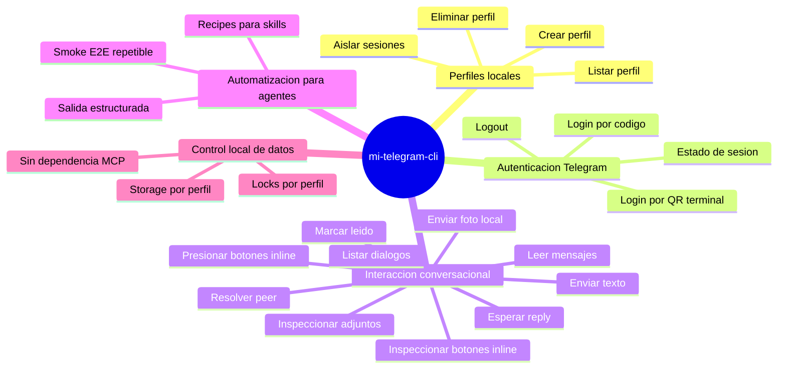

# 1. Objetivo del producto

`mi-telegram-cli` es una herramienta CLI local, headless y multicuenta para operar cuentas reales de Telegram con control total de sesiones y datos en la máquina del operador. Su objetivo es habilitar automatización E2E profunda desde la perspectiva de usuario para bots y flujos conversacionales, especialmente desde skills de Codex o Claude Code, sin depender de un MCP externo ni delegar credenciales a terceros.

El éxito del MVP se mide por su capacidad de ejecutar de forma repetible el smoke real de un bot objetivo: autenticar una cuenta dedicada, abrir el diálogo, enviar mensajes, leer respuestas y dejar evidencia estructurada reutilizable por agentes.

## 2. Propuesta de valor

- Control local completo de sesiones, perfiles y estado operativo por cuenta.
- Aislamiento fuerte entre cuentas para evitar contaminación de QA y mezcla de identidades.
- Superficie CLI estable y automatizable desde skills, sin acoplarse a un MCP específico.
- Enfoque explícito en QA conversacional real sobre bots, no en scraping ni uso humano interactivo general más allá del bootstrap mínimo de autenticación.
- Base técnica extensible para crecer luego a media, adjuntos, daemon local o más capacidades.

## 3. Mapa de capacidades

## 4. Actores

| Actor | Responsabilidad principal |
| --- | --- |
| Operador tecnico | Configura perfiles, credenciales y ejecuta flujos de QA locales. |
| Agente de codigo | Invoca el CLI desde una skill para automatizar envíos, lecturas y validaciones. |
| Cuenta Telegram dedicada | Identidad real usada para ejecutar pruebas E2E sin usar cuentas personales. |
| Plataforma Telegram | Provee autenticación, diálogos, entrega y recepción de mensajes vía MTProto. |
| Bot o sistema bajo prueba | Responde a los mensajes enviados por la cuenta dedicada y permite validar el flujo E2E. |

## 5. Areas funcionales de alto nivel

| Area | Alcance MVP |
| --- | --- |
| Gestion de perfiles locales | Alta, consulta, listado y baja segura de perfiles con aislamiento por cuenta. |
| Autenticacion y sesion | Login por código o QR de terminal, reutilizacion de sesion vigente, consulta de estado y logout. |
| Dialogos y resolucion de peer | Descubrir el dialogo objetivo y resolver username/chat id/dialog id a un peer utilizable. |
| Operacion de mensajes | Leer mensajes recientes con metadata de adjuntos y botones inline, enviar texto, enviar una foto local validada (jpg/jpeg/png/webp, <= 10 MiB) con caption opcional, esperar un reply enriquecido, presionar botones inline compatibles y marcar como leido. |
| Integracion con agentes | Proveer comandos y salida estructurada para skills de Codex/Claude sin MCP propio. |

## 6. Fuera de alcance / Evolucion futura

- Descarga local de adjuntos o export de binarios a disco.
- Accionar botones que requieran abrir WebView, navegador externo, compartir telefono/ubicacion, o confirmar identidad con password/SRP.
- Interfaz grafica o experiencia de usuario interactiva rica para humanos fuera del bootstrap minimo de auth en terminal.
- Daemon persistente o scheduler local de larga vida.
- Importacion de sesiones desde Telegram Desktop (`tdesktop`) en el MVP.
- Servidor MCP propio para la v1.
- Automatizacion genérica de toda la superficie Telegram fuera del foco QA conversacional.
