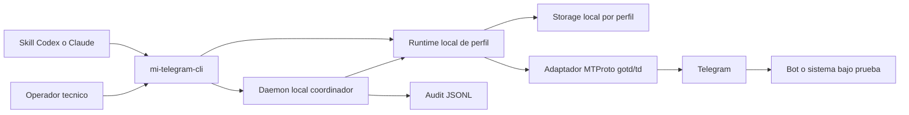
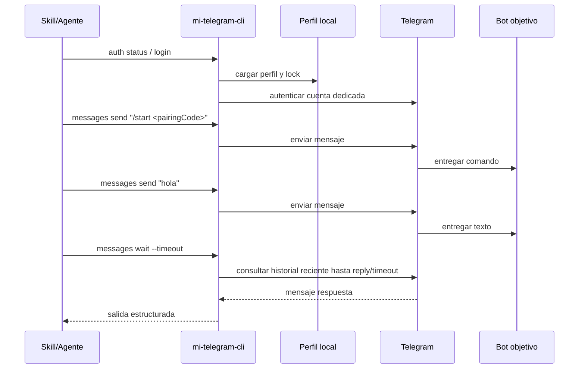

# 1. Resumen de arquitectura

`mi-telegram-cli` se implementa como un binario local en Go que encapsula el acceso MTProto a Telegram sobre `gotd/td`, administra perfiles locales aislados y expone una superficie CLI estable para automatización por shell. La v1 introduce un daemon local de usuario, headless y loopback-only, que coordina cola FIFO por perfil y auditoría operativa sin mantener pooling persistente de conexiones MTProto.

## 2. Project Decision Priority

Fuente de verdad para este proyecto:

1. Seguridad
2. Aislamiento
3. Correctitud
4. Confiabilidad
5. Mantenibilidad
6. Costo
7. Time-to-market

## 3. Vista de contenedores

## 4. Componentes y responsabilidades

| Componente | Tipo | Responsabilidad |
| --- | --- | --- |
| `mi-telegram-cli` | Binario local | Parsea comandos, valida entradas, aplica locks y entrega salida estructurada. |
| Runtime de perfil | Limite lógico interno | Carga contexto de un perfil, resuelve peer, ejecuta operaciones y garantiza aislamiento. |
| Storage local por perfil | Persistencia local | Guarda metadata del perfil, sesión MTProto derivada, estado operativo y locks. |
| Daemon local coordinador | Proceso local headless | Auto-start para comandos Telegram, cola FIFO por perfil, lease de login y auditoría JSONL. |
| Auditoría JSONL | Persistencia operativa local | Guarda eventos diarios redacted y summaries de latencia/errores. |
| Adaptador Telegram | Integración | Traduce operaciones del CLI a llamadas MTProto vía `gotd/td`. |
| Skill de agente | Integración local | Invoca el CLI desde shell y adapta su salida al flujo de Codex/Claude. |
| Telegram | Servicio externo | Autenticación, diálogos, recepción y entrega de mensajes. |

## 5. Stack tecnologico

| Capa | Tecnologia | Razon |
| --- | --- | --- |
| CLI | Go | Binario único, fácil distribución local y buen encastre con el patrón de `mi-lsp`. |
| Cliente Telegram | `gotd/td` | Cliente MTProto maduro para usuarios y bots, con control total desde Go. |
| Persistencia local | Archivos por perfil | Minimiza dependencias externas y favorece aislamiento por cuenta. |
| Salida automatizable | JSON opcional + texto humano | Permite uso directo por shell y por skills de agentes. |
| Integración de agentes | Skill folder-based | Evita acoplar la herramienta a un protocolo MCP particular. |

## 6. Secuencia representativa: smoke E2E

## 7. Decisiones arquitectonicas base

- V1 CLI-first, sin MCP propio.
- V1 con daemon local de usuario para coordinación y auditoría; no expone admin UI ni endpoints remotos.
- Un perfil = una cuenta Telegram dedicada = un storage aislado.
- Los perfiles y sesiones ya logueados se comparten entre proyectos desde `~/.mi-telegram-cli`; no se introduce storage por repo.
- Auto-start por defecto para `auth status/logout`, `me`, `dialogs *` y `messages *`; `MI_TELEGRAM_CLI_DAEMON=off` fuerza modo directo y `required` falla si el daemon no está disponible.
- `auth login` interactivo se protege con lease externa del daemon; TTL = timeout de login + 30s, cap 10m.
- La cola FIFO por perfil tiene timeout default 120s, configurable con `MI_TELEGRAM_CLI_QUEUE_TIMEOUT_SECONDS` y `--queue-timeout`; si vence antes de ejecutar devuelve `QueueTimeout`.
- El daemon v1 no mantiene pooling persistente de conexión MTProto; coordina, mide y deja evidencia para decidir pooling futuro.
- `auth login` soporta código o QR de terminal sin abrir browser ni UI gráfica adicional.
- Las operaciones son síncronas por comando; `messages wait` usa espera con timeout por invocación.
- `messages wait` observa mensajes recientes del peer dentro del proceso de esa invocación y no introduce listeners persistentes ni background workers.
- `messages read` y `messages wait` exponen un `MensajeResumen` enriquecido con metadata de adjuntos y botones inline, sin descargar archivos.
- `messages press-button` opera sobre un `messageId` exacto y un selector de botón explícito; ejecuta callbacks reales y puede informar URLs visibles sin abrir UI externa.
- `messages send-photo` sube UNA foto local validada antes de tocar Telegram (existencia, extension `{jpg,jpeg,png,webp}`, cap 10 MiB) y devuelve metadata derivada (`media{kind,mimeType,sizeBytes,sha256,caption?}`) sin exponer el `filePath` local.
- El perfil `qa-alt` es estado de usuario real protegido: el guard cross-cutting rechaza con `ProfileProtected` cualquier subcomando modificador (`auth login`, `auth logout`, `dialogs mark-read`, `messages send`, `messages send-photo`, `messages press-button`) y permite los read-only para inspección humana.
- La sesión MTProto es derivada física y no redefine el modelo semántico.

## 8. Insumos para FL

### Inventario inicial de flujos

| Flow ID | Objetivo | Actores | Modulos |
| --- | --- | --- | --- |
| `FL-PRF-01` | Gestionar perfiles locales | Operador tecnico, Agente | CLI, Storage local |
| `FL-AUT-01` | Autenticar cuenta y persistir sesion | Operador tecnico, Telegram | CLI, Adaptador Telegram, Storage local |
| `FL-AUT-02` | Consultar o cerrar sesion | Operador tecnico, Agente | CLI, Storage local |
| `FL-AUT-03` | Consultar identidad activa del perfil | Operador tecnico, Agente | CLI, Adaptador Telegram |
| `FL-DLG-01` | Listar dialogos y resolver peer | Agente, Telegram | CLI, Adaptador Telegram |
| `FL-MSG-01` | Leer mensajes recientes enriquecidos | Agente, Telegram | CLI, Adaptador Telegram |
| `FL-MSG-02` | Enviar mensaje de texto | Agente, Telegram, Bot objetivo | CLI, Adaptador Telegram |
| `FL-MSG-03` | Esperar reply enriquecido para smoke E2E | Agente, Telegram, Bot objetivo | CLI, Adaptador Telegram |
| `FL-MSG-04` | Marcar dialogo como leido | Agente, Telegram | CLI, Adaptador Telegram |
| `FL-MSG-05` | Presionar boton inline de un mensaje | Agente, Telegram, Bot objetivo | CLI, Adaptador Telegram |
| `FL-MSG-06` | Enviar foto a peer | Agente, Telegram, Bot objetivo | CLI, Adaptador Telegram |
| `FL-SKL-01` | Ejecutar smoke desde skill | Agente, Bot objetivo | Skill, CLI |
| `FL-DAE-01` | Coordinar comandos concurrentes por perfil | Agente, Operador tecnico | CLI, Daemon local, Storage local |
| `FL-AUD-01` | Auditar ejecución local sin secretos | Agente, Operador tecnico | CLI, Auditoría JSONL |

### Estados, eventos y ownership

- Estados clave: `PerfilLocal`, `EstadoAutorizacionTelegram`, `LockPerfil`, `CursorLectura`.
- Eventos relevantes: `ProfileCreated`, `LoginCompleted`, `MessageSent`, `ReplyObserved`, `DialogMarkedRead`.
- Ownership:
  - CLI: validación, locking, envelope de salida.
  - Storage local: persistencia derivada y aislamiento.
  - Adaptador Telegram: ejecución MTProto.
  - Skill: orquestación del smoke.

### Bottlenecks y mitigaciones

- Mezcla accidental de sesiones entre cuentas: mitigado con storage aislado y lock por perfil.
- Peer ambiguo o mal resuelto: mitigado con una etapa explícita de resolución antes de leer/enviar.
- Timeout esperando respuesta del bot: mitigado con `messages wait --timeout` y error tipado.
- Selección ambigua del botón: mitigado con `button-index` prioritario y error tipado por texto duplicado.
- Re-login innecesario o sesión inválida: mitigado con `auth status` y reutilización controlada.
- Competencia entre proyectos por el mismo perfil: mitigado con daemon local, cola FIFO por perfil y timeout tipado `QueueTimeout`.
- Drift operativo no diagnosticable: mitigado con eventos JSONL redacted y `audit summary`.

### Open questions

`0`
