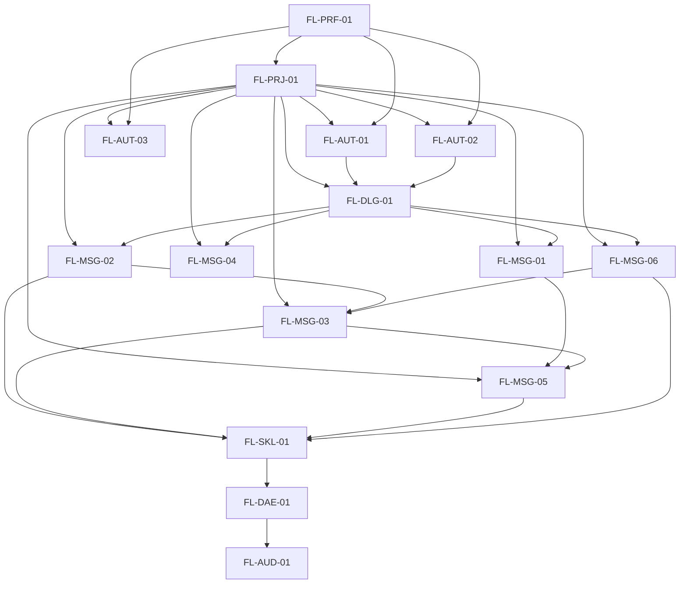

# 1. Prioridad de decision del proyecto

Fuente de verdad para decisiones de flujo:

1. Seguridad
2. Aislamiento
3. Correctitud
4. Confiabilidad
5. Mantenibilidad
6. Costo
7. Time-to-market

## 2. Inventario de flujos

| Flow ID | Objetivo | Actores principales | Modulos de arquitectura |
| --- | --- | --- | --- |
| `FL-PRF-01` | Gestionar perfiles locales | Operador tecnico, Agente | CLI, Storage local |
| `FL-PRJ-01` | Vincular proyectos a perfiles QA fijos | Operador tecnico, Agente | CLI, Registro global, Storage local |
| `FL-AUT-01` | Autenticar cuenta y persistir sesion | Operador tecnico, Telegram | CLI, Adaptador Telegram, Storage local |
| `FL-AUT-02` | Consultar o cerrar sesion | Operador tecnico, Agente | CLI, Storage local |
| `FL-AUT-03` | Consultar identidad activa del perfil | Operador tecnico, Agente | CLI, Adaptador Telegram |
| `FL-DLG-01` | Listar dialogos y resolver peer | Agente, Telegram | CLI, Adaptador Telegram |
| `FL-MSG-01` | Leer mensajes recientes enriquecidos | Agente, Telegram | CLI, Adaptador Telegram |
| `FL-MSG-02` | Enviar mensaje de texto | Agente, Telegram, Bot objetivo | CLI, Adaptador Telegram |
| `FL-MSG-03` | Esperar reply enriquecido con timeout | Agente, Telegram, Bot objetivo | CLI, Adaptador Telegram |
| `FL-MSG-04` | Marcar dialogo como leido | Agente, Telegram | CLI, Adaptador Telegram |
| `FL-MSG-05` | Presionar boton inline de un mensaje | Agente, Telegram, Bot objetivo | CLI, Adaptador Telegram |
| `FL-MSG-06` | Enviar foto a peer | Agente, Telegram, Bot objetivo | CLI, Adaptador Telegram |
| `FL-SKL-01` | Ejecutar smoke E2E desde una skill | Agente, Bot objetivo | Skill, CLI |
| `FL-DAE-01` | Coordinar comandos concurrentes por perfil | Agente, Operador tecnico | CLI, Daemon local, Storage local |
| `FL-AUD-01` | Auditar ejecución local sin secretos | Agente, Operador tecnico | CLI, Auditoría JSONL |

## 3. Mapa de dependencias de flujo

## 3.1 Flujo `FL-DAE-01`

El agente o el operador invoca un comando Telegram con un perfil compartido.
El CLI asegura daemon local si el modo es `auto` o `required`, registra un ticket FIFO por perfil y espera hasta tomar el lock físico.
Si el comando llega a ejecutar, libera lock y ticket al terminar.
Si el timeout de cola vence antes de ejecutar, responde `QueueTimeout` y no toca Telegram.
`auth login` toma además una lease externa para proteger el tramo interactivo; si otra lease activa existe, responde `DaemonLeaseDenied`.

## 3.1.1 Flujo `FL-PRJ-01`

El operador vincula un repo a un perfil QA fijo con `projects bind --root <path> --profile <id>`.
Si el perfil existe, el binding se persiste en `~/.mi-telegram-cli/projects.json`.
Si el perfil no existe y llega `--create-profile`, el CLI crea metadata local `Unauthorized` sin tocar Telegram y luego persiste el binding.
Cuando un comando Telegram llega sin `--profile`, el CLI resuelve el perfil efectivo por el `cwd` actual usando el binding de prefijo más largo; si no hay binding, usa fallback legacy `qa-dev`.
Si el binding existe pero el perfil falta, responde `ProjectProfileMissing`.

## 3.2 Flujo `FL-AUD-01`

Cada comando ejecutable registra un evento JSONL diario con operación, perfil, cwd del proyecto invocador, pid, daemonPid, latencia de cola, duración, exitCode y error tipado.
La auditoría permite exportar eventos y resumir percentiles por operación, perfil y proyecto.
El evento no persiste texto de mensajes, captions, códigos, passwords, API hash, session blobs ni paths de archivos subidos.

## 4. Criterio de cierre para handoff a RF

- Ownership cerrado por paso.
- Estados y eventos relevantes identificados.
- Riesgos dominantes y mitigaciones explícitos.
- Variantes de error principales separadas del happy path.
- Referencias candidatas `FL-* -> RF-*` completas.

## 5. Estado del lote

| Flow ID | RF handoff |
| --- | --- |
| `FL-PRF-01` | Ready |
| `FL-PRJ-01` | Ready |
| `FL-AUT-01` | Ready |
| `FL-AUT-02` | Ready |
| `FL-AUT-03` | Ready |
| `FL-DLG-01` | Ready |
| `FL-MSG-01` | Ready |
| `FL-MSG-02` | Ready |
| `FL-MSG-03` | Ready |
| `FL-MSG-04` | Ready |
| `FL-MSG-05` | Ready |
| `FL-MSG-06` | Ready |
| `FL-SKL-01` | Ready |
| `FL-DAE-01` | Ready |
| `FL-AUD-01` | Ready |
