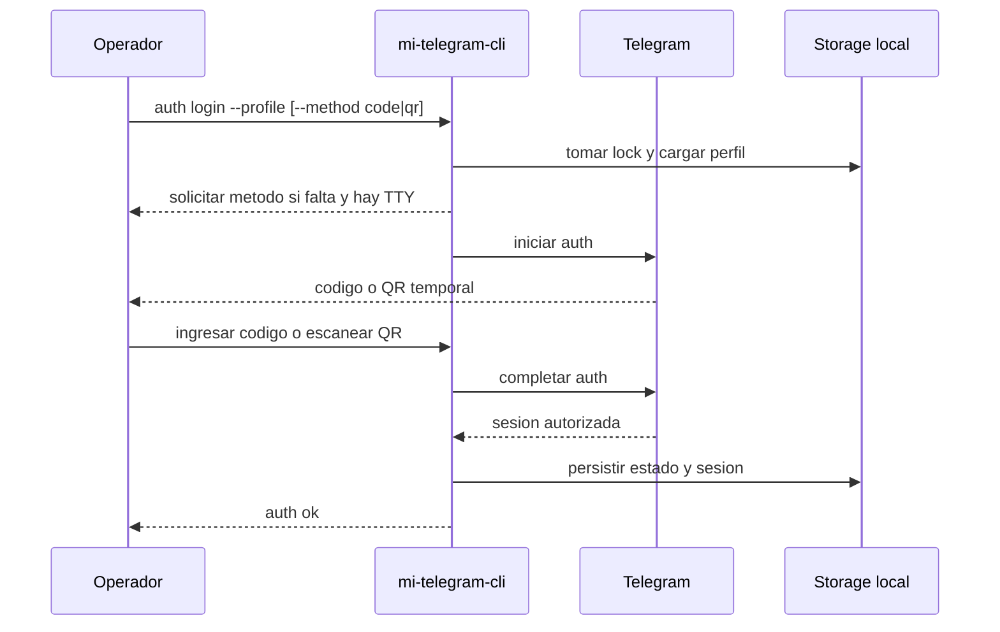
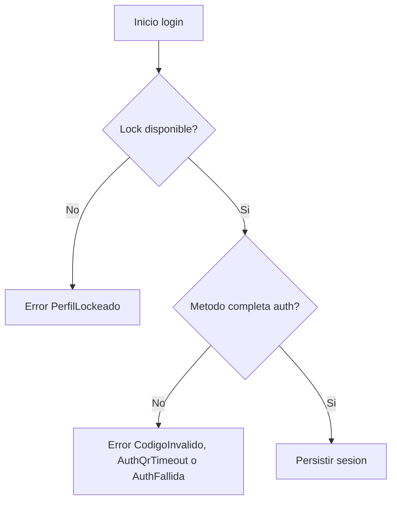

# FL-AUT-01 - Autenticar cuenta y persistir sesion

## 1. Goal

Permitir el login de una cuenta Telegram dedicada y persistir su sesión aislada dentro de un perfil local.

## 2. Scope in/out

- In: iniciar login por código o QR de terminal, completar autorización y guardar estado.
- Out: import de sesión externa, QR vía browser o UI gráfica, renovación automática de credenciales.

## 3. Actors and ownership

| Actor | Ownership |
| --- | --- |
| Operador tecnico | Selecciona metodo cuando el CLI lo solicita y luego provee telefono/codigo o escanea QR cuando corresponda. |
| CLI | Orquesta el login y protege el perfil. |
| Adaptador Telegram | Ejecuta la autorización MTProto. |
| Storage local | Persiste estado y sesión derivada. |
| Telegram | Valida la identidad. |

## 4. Preconditions

- El perfil existe.
- No hay otro proceso usando el mismo perfil.
- La cuenta es dedicada para QA.

## 5. Postconditions

- El perfil queda en estado autorizado reutilizable, o el login falla con error tipado sin contaminar otros perfiles.

## 6. Main sequence

## 7. Alternative/error path

## 8. Architecture slice

CLI + Storage local + Adaptador Telegram.

## 9. Data touchpoints

- `PerfilLocal`
- `EstadoAutorizacionTelegram`
- sesión MTProto derivada

## 10. Candidate RF references

- `RF-AUT-001`

## 11. Bottlenecks, risks, and selected mitigations

| Riesgo | Mitigacion |
| --- | --- |
| Mezcla de sesiones | Persistencia aislada por perfil. |
| Reintentos sobre perfil activo | Lock estricto durante login. |
| Login parcial | Guardar estado solo al completar autorización. |

## 12. RF handoff checklist

| Check | Estado |
| --- | --- |
| Ownership cerrado | Yes |
| Estados clave identificados | Yes |
| Variantes críticas identificadas | Yes |
| Riesgos dominantes documentados | Yes |
