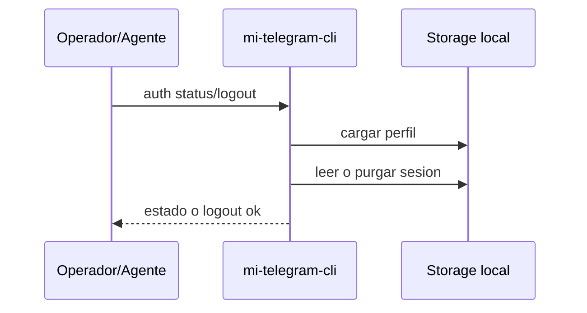

# FL-AUT-02 - Consultar o cerrar sesion

## 1. Goal

Permitir consultar el estado de autorización de un perfil y cerrar su sesión local de forma segura.

## 2. Scope in/out

- In: `auth status`, `auth logout`.
- Out: refresh automático de sesión o recuperación transparente.

## 3. Actors and ownership

| Actor | Ownership |
| --- | --- |
| Operador tecnico | Decide consultar o cerrar sesión. |
| Agente | Puede consultar estado antes de un smoke. |
| CLI | Lee estado actual o invalida la sesión local. |
| Storage local | Guarda o purga el estado derivado. |

## 4. Preconditions

- El perfil existe.

## 5. Postconditions

- El estado de autorización queda reportado correctamente o la sesión local queda invalidada.

## 6. Main sequence

## 7. Alternative/error path

| Caso | Resultado |
| --- | --- |
| Perfil inexistente | Error tipado |
| Logout sin sesión vigente | Resultado idempotente |
| Perfil lockeado por otra operación | Error tipado |

## 8. Architecture slice

CLI + Storage local.

## 9. Data touchpoints

- `PerfilLocal`
- `EstadoAutorizacionTelegram`

## 10. Candidate RF references

- `RF-AUT-002`
- `RF-AUT-003`

## 11. Bottlenecks, risks, and selected mitigations

| Riesgo | Mitigacion |
| --- | --- |
| Estado obsoleto | Resolver desde storage local vigente. |
| Logout concurrente con otra operación | Lock por perfil. |

## 12. RF handoff checklist

| Check | Estado |
| --- | --- |
| Ownership cerrado | Yes |
| Estados clave identificados | Yes |
| Variantes críticas identificadas | Yes |
| Riesgos dominantes documentados | Yes |

