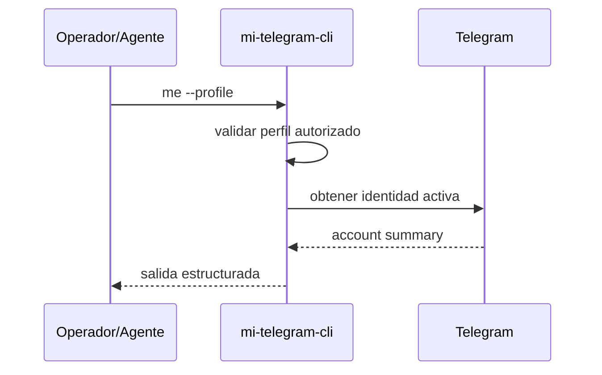

# FL-AUT-03 - Consultar identidad activa del perfil

## 1. Goal

Permitir consultar la identidad Telegram actualmente activa de un perfil autorizado sin exponer secretos ni blobs de sesion.

## 2. Scope in/out

- In: comando `me`, lectura de identidad resumida del perfil activo.
- Out: edicion del perfil remoto, administracion de privacidad o introspeccion de sesion binaria.

## 3. Actors and ownership

| Actor | Ownership |
| --- | --- |
| Operador tecnico | Puede inspeccionar la identidad activa para validar la cuenta QA. |
| Agente | Puede verificar la identidad antes de ejecutar un smoke. |
| CLI | Valida precondiciones, estructura salida y oculta secretos. |
| Adaptador Telegram | Obtiene la identidad activa desde la sesion autorizada. |

## 4. Preconditions

- El perfil existe.
- El perfil tiene una sesion autorizada utilizable.

## 5. Postconditions

- Se devuelve un `accountSummary` consistente con la sesion activa, o un error tipado si el perfil no esta autorizado o la consulta falla.

## 6. Main sequence

## 7. Alternative/error path

| Caso | Resultado |
| --- | --- |
| Perfil inexistente | Error tipado |
| Perfil sin sesion valida | `UnauthorizedProfile` |
| Falla el adaptador Telegram | `TelegramMeFailed` |

## 8. Architecture slice

CLI + Adaptador Telegram.

## 9. Data touchpoints

- `PerfilLocal`
- `EstadoAutorizacionTelegram`

## 10. Candidate RF references

- `RF-AUT-004`

## 11. Bottlenecks, risks, and selected mitigations

| Riesgo | Mitigacion |
| --- | --- |
| Confundir la cuenta activa | Consulta directa a la sesion autorizada del perfil. |
| Exponer secretos o telefono crudo | Envelope limitado a `accountSummary` sin datos sensibles. |

## 12. RF handoff checklist

| Check | Estado |
| --- | --- |
| Ownership cerrado | Yes |
| Estados clave identificados | Yes |
| Variantes criticas identificadas | Yes |
| Riesgos dominantes documentados | Yes |
