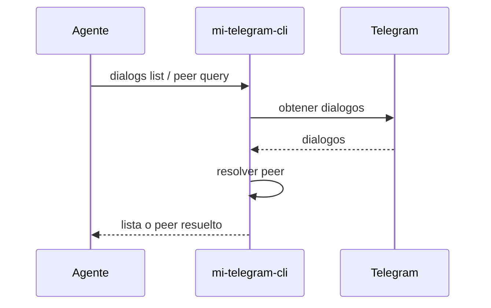

# FL-DLG-01 - Listar dialogos y resolver peer

## 1. Goal

Permitir descubrir el diálogo objetivo y resolver username, chat id o dialog id a un peer utilizable por operaciones de lectura o envío.

## 2. Scope in/out

- In: listado de diálogos, búsqueda y resolución de peer.
- Out: administración de grupos o edición de chats.

## 3. Actors and ownership

| Actor | Ownership |
| --- | --- |
| Agente | Solicita el diálogo objetivo. |
| CLI | Normaliza criterios y entrega peer resuelto. |
| Adaptador Telegram | Consulta diálogos reales. |
| Telegram | Fuente de verdad del diálogo. |

## 4. Preconditions

- Perfil autorizado.

## 5. Postconditions

- Peer objetivo resuelto de forma inequívoca o error explícito por ambigüedad/no existencia.

## 6. Main sequence

## 7. Alternative/error path

| Caso | Resultado |
| --- | --- |
| Perfil no autorizado | Error tipado |
| Peer ambiguo | Error con criterio de desambiguación |
| Peer inexistente | Error tipado |

## 8. Architecture slice

CLI + Adaptador Telegram.

## 9. Data touchpoints

- `DialogoResumen`
- `PeerObjetivo`

## 10. Candidate RF references

- `RF-DLG-001`
- `RF-DLG-002`

## 11. Bottlenecks, risks, and selected mitigations

| Riesgo | Mitigacion |
| --- | --- |
| Peer mal elegido por el agente | Resolución explícita con error por ambigüedad. |
| Listado grande | Límite y filtros en RF. |

## 12. RF handoff checklist

| Check | Estado |
| --- | --- |
| Ownership cerrado | Yes |
| Estados clave identificados | Yes |
| Variantes críticas identificadas | Yes |
| Riesgos dominantes documentados | Yes |

