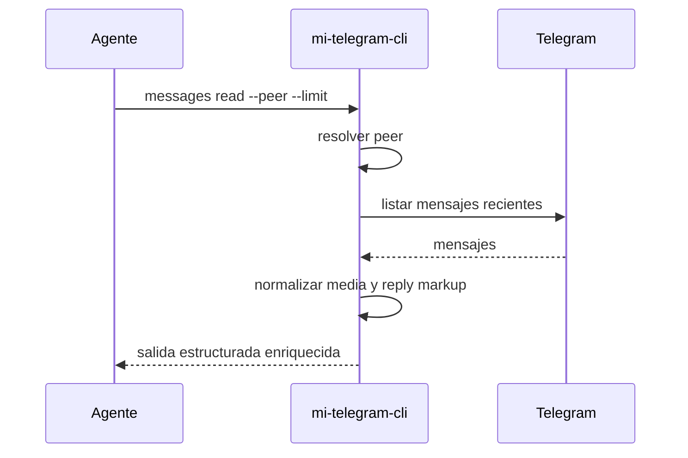

# FL-MSG-01 - Leer mensajes recientes enriquecidos

## 1. Goal

Leer mensajes recientes de un peer resuelto para inspección conversacional o verificación E2E, incluyendo metadata de adjuntos y botones inline.

## 2. Scope in/out

- In: lectura reciente con límite controlado y normalización de `attachments[]` / `buttons[]`.
- Out: búsqueda global, descarga de adjuntos, export masivo.

## 3. Actors and ownership

| Actor | Ownership |
| --- | --- |
| Agente | Pide la lectura del diálogo. |
| CLI | Resuelve el peer, valida límite y estructura salida. |
| Adaptador Telegram | Recupera mensajes desde Telegram. |

## 4. Preconditions

- Perfil autorizado.
- Peer resuelto o resoluble.

## 5. Postconditions

- Se devuelven mensajes recientes ordenados, o error tipado.

## 6. Main sequence

## 7. Alternative/error path

| Caso | Resultado |
| --- | --- |
| Peer inválido | Error tipado |
| Límite fuera de rango | Error de validación |
| Sesión vencida | Error tipado de autorización |

## 8. Architecture slice

CLI + Adaptador Telegram.

## 9. Data touchpoints

- `PeerObjetivo`
- `MensajeResumen`
- `CursorLectura`

## 10. Candidate RF references

- `RF-MSG-001`

## 11. Bottlenecks, risks, and selected mitigations

| Riesgo | Mitigacion |
| --- | --- |
| Leer del diálogo equivocado | Reusar resolución estricta de peer. |
| Sobrecarga por lectura grande | Límite máximo en RF. |
| Media o botones difíciles de interpretar por el agente | Normalizar `attachments[]` y `buttons[]` con shape estable. |

## 12. RF handoff checklist

| Check | Estado |
| --- | --- |
| Ownership cerrado | Yes |
| Estados clave identificados | Yes |
| Variantes críticas identificadas | Yes |
| Riesgos dominantes documentados | Yes |
