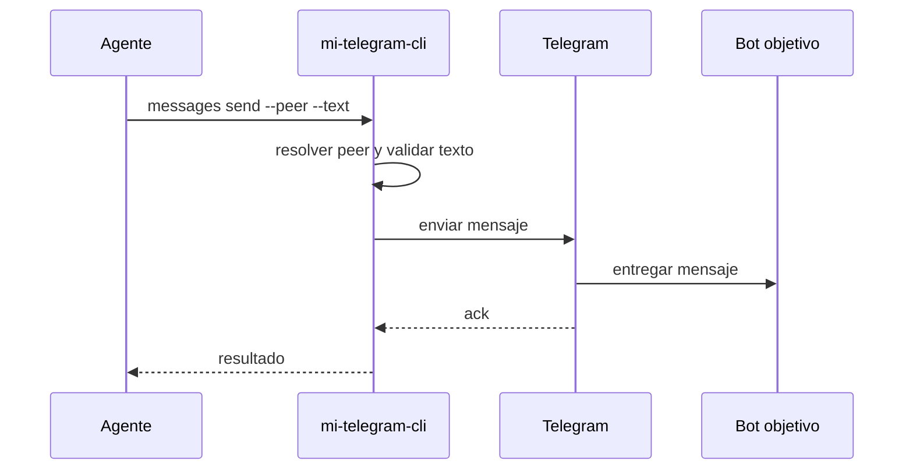

# FL-MSG-02 - Enviar mensaje de texto

## 1. Goal

Enviar un mensaje de texto a un peer resuelto para disparar un flujo conversacional real.

## 2. Scope in/out

- In: envío de texto plano controlado por CLI.
- Out: media, stickers, edición de mensajes.

## 3. Actors and ownership

| Actor | Ownership |
| --- | --- |
| Agente | Pide el envío. |
| CLI | Valida texto, resuelve peer y controla salida. |
| Adaptador Telegram | Ejecuta el envío MTProto. |
| Bot objetivo | Recibe el mensaje. |

## 4. Preconditions

- Perfil autorizado.
- Peer resuelto.
- Texto no vacío y dentro de límites definidos por RF.

## 5. Postconditions

- El mensaje queda enviado o se devuelve error tipado sin reintento implícito.

## 6. Main sequence

## 7. Alternative/error path

| Caso | Resultado |
| --- | --- |
| Texto vacío | Error de validación |
| Peer inválido | Error tipado |
| Envío rechazado | Error tipado del adaptador |

## 8. Architecture slice

CLI + Adaptador Telegram.

## 9. Data touchpoints

- `PeerObjetivo`
- `MensajeResumen`

## 10. Candidate RF references

- `RF-MSG-002`

## 11. Bottlenecks, risks, and selected mitigations

| Riesgo | Mitigacion |
| --- | --- |
| Envío al peer equivocado | Reusar resolución explícita. |
| Reenvío accidental | Sin retry implícito en v1. |

## 12. RF handoff checklist

| Check | Estado |
| --- | --- |
| Ownership cerrado | Yes |
| Estados clave identificados | Yes |
| Variantes críticas identificadas | Yes |
| Riesgos dominantes documentados | Yes |

