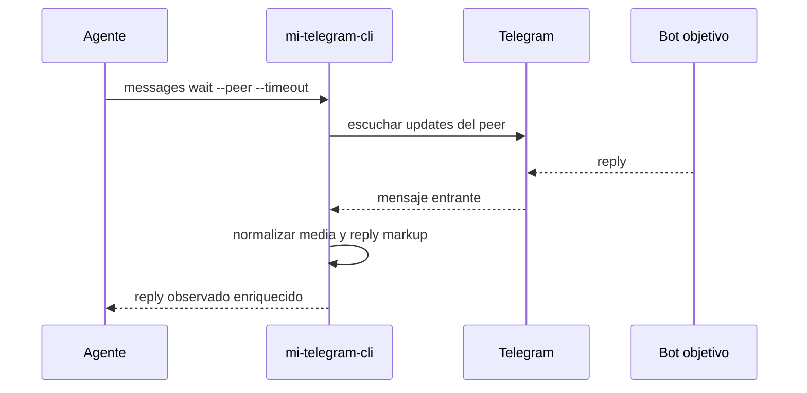
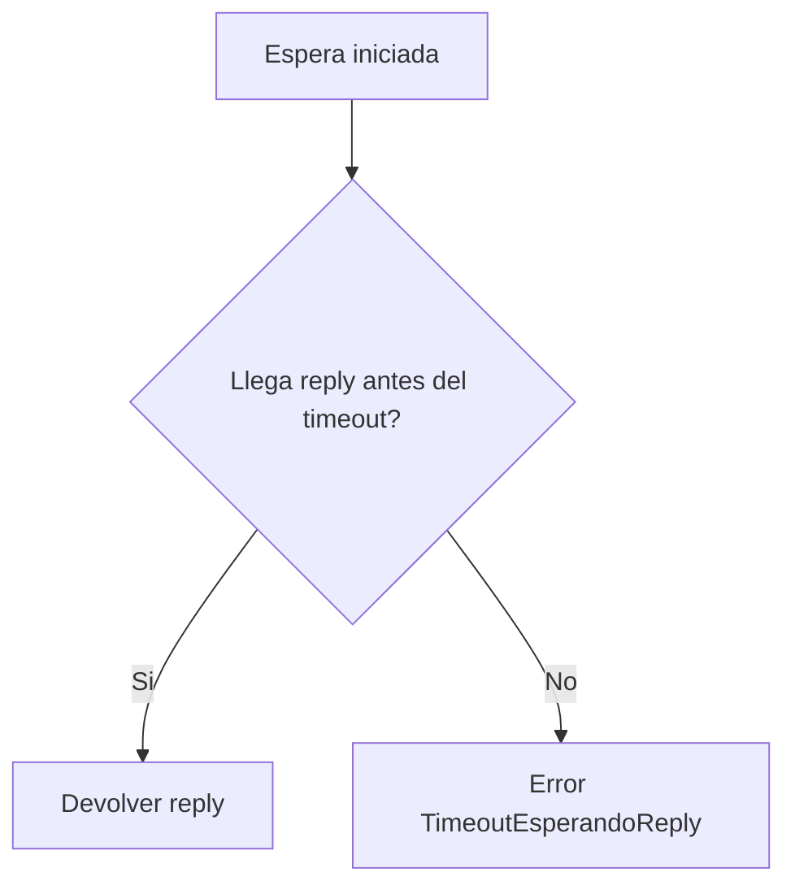

# FL-MSG-03 - Esperar reply enriquecido con timeout

## 1. Goal

Esperar un mensaje entrante en un peer objetivo dentro de una ventana controlada para validar respuestas E2E, devolviendo también metadata de adjuntos y botones inline del reply observado.

## 2. Scope in/out

- In: espera con timeout, filtro por peer y reply enriquecido.
- Out: listener persistente, subscriptions de larga vida.

## 3. Actors and ownership

| Actor | Ownership |
| --- | --- |
| Agente | Define el peer y el timeout esperado. |
| CLI | Orquesta la espera y define el resultado observable. |
| Adaptador Telegram | Escucha actualizaciones del peer. |
| Bot objetivo | Produce o no la respuesta. |

## 4. Preconditions

- Perfil autorizado.
- Peer resuelto.
- Existe un contexto de prueba que justifica la espera.

## 5. Postconditions

- Se observa un reply relevante o expira el timeout con error tipado.

## 6. Main sequence

## 7. Alternative/error path

## 8. Architecture slice

CLI + Adaptador Telegram.

## 9. Data touchpoints

- `PeerObjetivo`
- `MensajeResumen`
- `CursorLectura`

## 10. Candidate RF references

- `RF-MSG-003`

## 11. Bottlenecks, risks, and selected mitigations

| Riesgo | Mitigacion |
| --- | --- |
| Espera indefinida | Timeout obligatorio. |
| Reply previo confundido con reply nuevo | Filtro por after-id/cursor en RF. |
| El reply incluye botones o adjuntos y el agente no puede actuar | El reply expone metadata estable para pasos posteriores. |

## 12. RF handoff checklist

| Check | Estado |
| --- | --- |
| Ownership cerrado | Yes |
| Estados clave identificados | Yes |
| Variantes críticas identificadas | Yes |
| Riesgos dominantes documentados | Yes |
