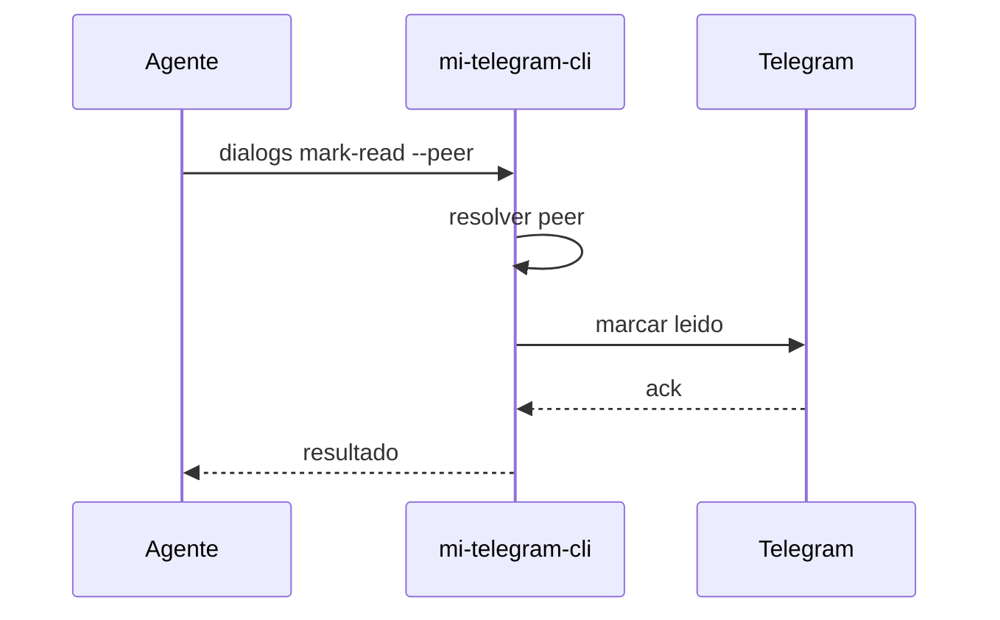

# FL-MSG-04 - Marcar dialogo como leido

## 1. Goal

Marcar un diálogo como leído para mantener el contexto operativo limpio luego de una verificación.

## 2. Scope in/out

- In: marcar leído un peer resuelto.
- Out: archivado, mute o acciones de moderación.

## 3. Actors and ownership

| Actor | Ownership |
| --- | --- |
| Agente | Dispara la limpieza operativa. |
| CLI | Valida peer y reporta resultado. |
| Adaptador Telegram | Ejecuta la acción sobre Telegram. |

## 4. Preconditions

- Perfil autorizado.
- Peer resuelto.

## 5. Postconditions

- El diálogo queda marcado como leído o se devuelve error tipado.

## 6. Main sequence

## 7. Alternative/error path

| Caso | Resultado |
| --- | --- |
| Peer inválido | Error tipado |
| Sesión no autorizada | Error tipado |
| Operación rechazada | Error tipado |

## 8. Architecture slice

CLI + Adaptador Telegram.

## 9. Data touchpoints

- `PeerObjetivo`
- `CursorLectura`

## 10. Candidate RF references

- `RF-MSG-004`

## 11. Bottlenecks, risks, and selected mitigations

| Riesgo | Mitigacion |
| --- | --- |
| Marcar leído el chat equivocado | Reusar resolución estricta de peer. |
| Ocultar evidencia útil antes de tiempo | Operación explícita y separada. |

## 12. RF handoff checklist

| Check | Estado |
| --- | --- |
| Ownership cerrado | Yes |
| Estados clave identificados | Yes |
| Variantes críticas identificadas | Yes |
| Riesgos dominantes documentados | Yes |

