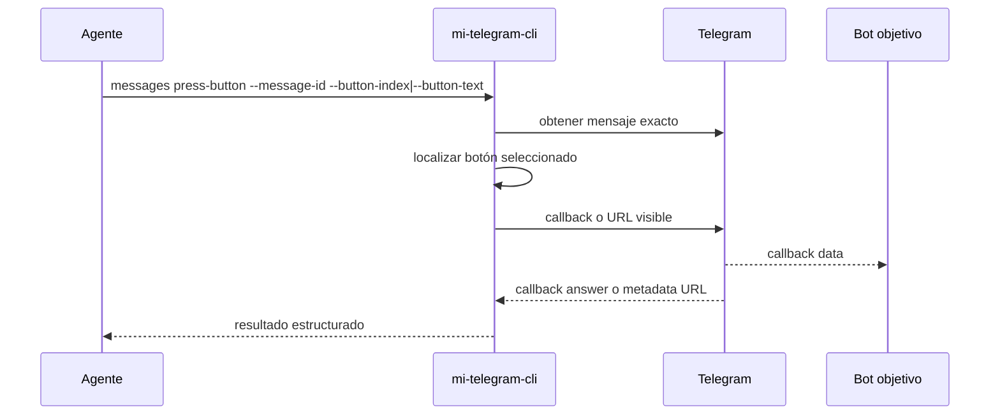

# FL-MSG-05 - Presionar boton inline de un mensaje

## 1. Goal

Permitir que un agente accione un botón inline visible en un mensaje concreto usando un selector explícito y sin depender de taps de UI.

## 2. Scope in/out

- In: selección por `button-index` o `button-text`, resolución exacta por `messageId`, callbacks reales e información de URL.
- Out: WebView, navegador externo, botones que requieran compartir teléfono/ubicación o password/SRP.

## 3. Actors and ownership

| Actor | Ownership |
| --- | --- |
| Agente | Elige el mensaje y el botón a accionar. |
| CLI | Valida selectores, resuelve el mensaje exacto y define el resultado observable. |
| Adaptador Telegram | Ejecuta el callback o recupera la URL visible del botón. |

## 4. Preconditions

- Perfil autorizado.
- Peer resuelto.
- `messageId` visible del mensaje objetivo.
- Existe al menos un botón inline compatible en ese mensaje.

## 5. Postconditions

- Se ejecuta un callback real o se informa la URL del botón.

## 6. Main sequence

## 7. Alternative/error path

| Caso | Resultado |
| --- | --- |
| `messageId` inexistente | Error tipado |
| Texto duplicado | `ButtonAmbiguous` |
| Botón no soportado | `ButtonUnsupported` |
| Botón callback con password requerida | `ButtonPasswordRequired` |

## 8. Architecture slice

CLI + Adaptador Telegram.

## 9. Data touchpoints

- `PeerObjetivo`
- `MensajeResumen`

## 10. Candidate RF references

- `RF-MSG-005`

## 11. Bottlenecks, risks, and selected mitigations

| Riesgo | Mitigacion |
| --- | --- |
| Selector frágil por copy cambiante | `button-index` prioritario y contractual. |
| Clicks ambiguos sobre labels repetidos | Error tipado por ambigüedad. |
| Botones visibles pero no headless-friendly | Error tipado por tipo no soportado. |

## 12. RF handoff checklist

| Check | Estado |
| --- | --- |
| Ownership cerrado | Yes |
| Estados clave identificados | Yes |
| Variantes críticas identificadas | Yes |
| Riesgos dominantes documentados | Yes |
