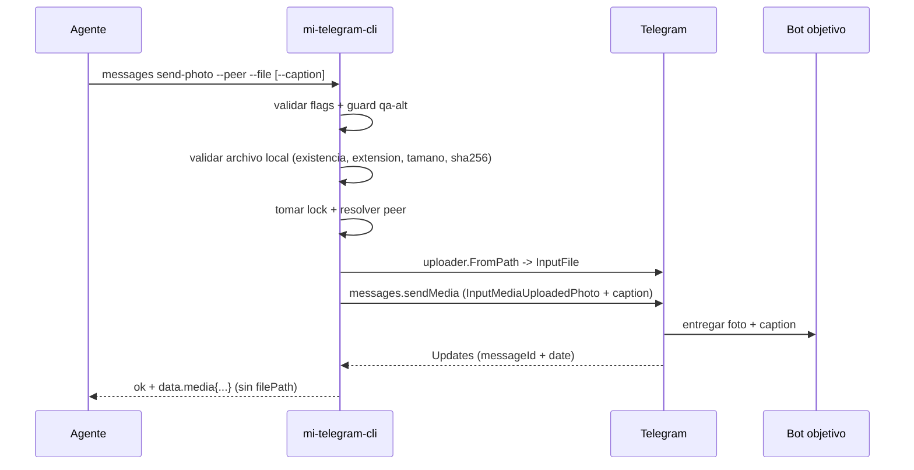

# FL-MSG-06 - Enviar foto a peer

## 1. Goal

Subir una imagen local desde disco y enviarla a un peer resuelto, dejando la foto saliente como evidencia para validar flujos de bot que dependen de media (VIS, OCR, ingestion de imagenes).

## 2. Scope in/out

- In: envio de UNA foto local con caption opcional, validada antes de tocar Telegram.
- Out: video, voice, sticker, documents, albums (`grouped_id`), edicion o reenvio de fotos ya existentes.

## 3. Actors and ownership

| Actor | Ownership |
| --- | --- |
| Agente | Pide el envio con `messages send-photo`. |
| CLI | Valida flags, archivo local (existencia, extension, cap 10 MiB), guard de perfil protegido y resuelve peer. |
| Adaptador Telegram | Sube el archivo via uploader y ejecuta `messages.sendMedia` con `inputMediaUploadedPhoto`. |
| Bot objetivo | Recibe la foto y dispara su pipeline de procesamiento. |

## 4. Preconditions

- Perfil autorizado y NO protegido (`qa-alt` queda fuera por el guard cross-cutting).
- Peer resuelto inequivocamente.
- Archivo local existente, no vacio, no directorio, tamano <= 10 MiB.
- Extension permitida: `jpg`, `jpeg`, `png`, `webp`.
- Caption opcional, `0..1024` chars sin parse mode.

## 5. Postconditions

- La foto queda enviada o se devuelve error tipado sin reintento implicito.
- El output expone `data.media{kind, mimeType, sizeBytes, sha256[, caption]}`; el `filePath` original NO aparece en la respuesta.
- El `messageId` retornado es la referencia observable para `messages wait` posteriores.

## 6. Main sequence

## 7. Alternative/error path

| Caso | Resultado |
| --- | --- |
| Archivo inexistente | `FileNotFound` antes de tocar Telegram |
| Extension fuera de `{jpg,jpeg,png,webp}` | `UnsupportedMediaType` |
| Archivo > 10 MiB o vacio o directorio | `InvalidInput` |
| Caption > 1024 chars | `InvalidInput` |
| `--profile qa-alt` | `ProfileProtected` (guard cross-cutting) |
| Peer no resuelto | `PeerNotFound` |
| Peer ambiguo | `PeerAmbiguous` |
| Telegram rechaza upload o sendMedia | `TelegramSendPhotoFailed` |

## 8. Architecture slice

CLI + Adaptador Telegram + uploader local. Sin nuevo storage persistente.

## 9. Data touchpoints

- `PeerObjetivo`
- `MensajeResumen` saliente con `attachments[].kind=photo`
- Hash local `SHA256` derivado del archivo enviado (no persistido)

## 10. Candidate RF references

- `RF-MSG-006`

## 11. Bottlenecks, risks, and selected mitigations

| Riesgo | Mitigacion |
| --- | --- |
| Subir archivo equivocado por path mal escrito | Validacion local previa + SHA256 en el output como huella reproducible. |
| Filtrar paths locales sensibles en el JSON | El executor omite `filePath` del envelope; los tests `TP-MSG-038` lo verifican. |
| Mutar el perfil real de usuario por automatizacion | Guard `qa-alt` cross-cutting (`TP-MSG-040`). |
| Subir un archivo > 10 MiB que Telegram rechazaria igual | Validacion de tamano antes de abrir el adaptador. |

## 12. RF handoff checklist

| Check | Estado |
| --- | --- |
| Ownership cerrado | Yes |
| Estados clave identificados | Yes |
| Variantes criticas identificadas | Yes |
| Riesgos dominantes documentados | Yes |
