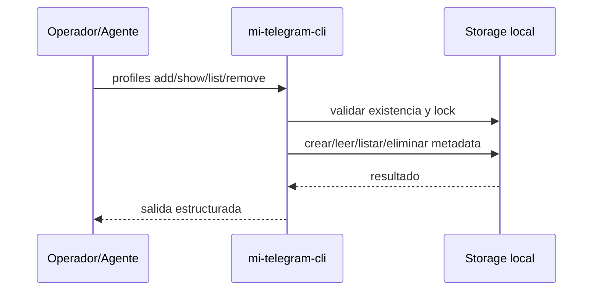
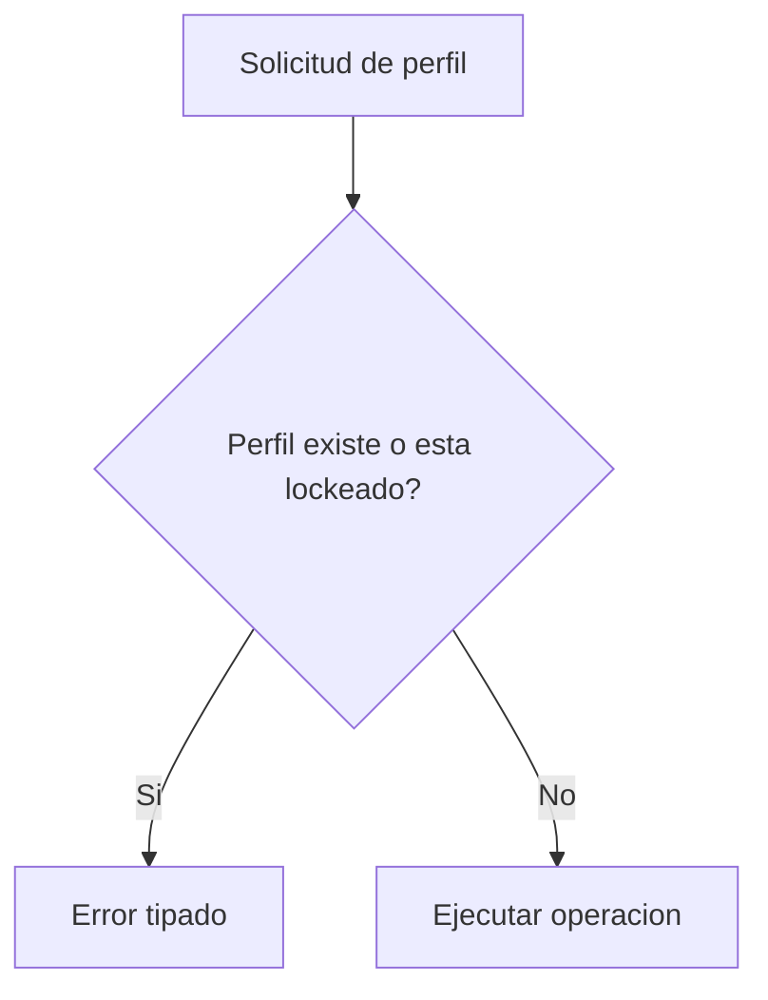

# FL-PRF-01 - Gestionar perfiles locales

## 1. Goal

Permitir crear, consultar, listar y eliminar perfiles locales aislados para cuentas Telegram dedicadas.

## 2. Scope in/out

- In: alta, consulta, listado y baja segura de perfiles.
- Out: login Telegram, envío de mensajes, import de perfiles externos.

## 3. Actors and ownership

| Actor | Ownership |
| --- | --- |
| Operador tecnico | Define el perfil a crear o eliminar. |
| Agente | Invoca comandos automatizados de consulta. |
| CLI | Valida entradas y aplica reglas de seguridad. |
| Storage local | Persiste metadata y lock del perfil. |

## 4. Preconditions

- El entorno local tiene permisos para crear el storage del perfil.
- El identificador del perfil no colisiona con uno activo, salvo consulta/listado.

## 5. Postconditions

- El perfil queda persistido y aislado, o bien eliminado sin dejar estado reutilizable.

## 6. Main sequence

## 7. Alternative/error path

## 8. Architecture slice

CLI + Storage local por perfil.

## 9. Data touchpoints

- `PerfilLocal`
- `LockPerfil`

## 10. Candidate RF references

- `RF-PRF-001`
- `RF-PRF-002`
- `RF-PRF-003`

## 11. Bottlenecks, risks, and selected mitigations

| Riesgo | Mitigacion |
| --- | --- |
| Colision de perfiles | ID único y validación previa. |
| Corrupción por acceso concurrente | Lock por perfil. |
| Baja insegura | Eliminación sólo sin sesión activa o con confirmación explícita en RF. |

## 12. RF handoff checklist

| Check | Estado |
| --- | --- |
| Ownership cerrado | Yes |
| Estados clave identificados | Yes |
| Variantes críticas identificadas | Yes |
| Riesgos dominantes documentados | Yes |

