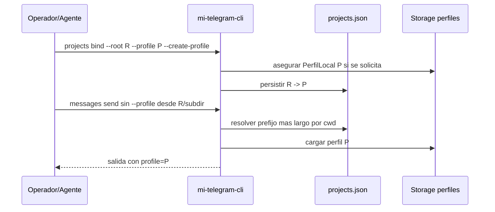

# FL-PRJ-01 - Vincular proyectos a perfiles QA fijos

## 1. Goal

Permitir que cada repo use un perfil QA fijo propio, resuelto automáticamente por `cwd`, para evitar que proyectos concurrentes compartan la misma sesión física.

## 2. Scope in/out

- In: bind/list/show/current/remove de bindings `projectRoot -> profileId`.
- In: creación opcional de metadata local no autorizada con `--create-profile`.
- Out: login automático, migración o copia de `session.bin`.

## 3. Main sequence

## 4. Error path

- Perfil ausente durante `bind` sin `--create-profile`: `ProfileNotFound`.
- Binding ausente durante `show/remove`: `ProjectBindingNotFound`.
- Binding efectivo apunta a perfil eliminado: `ProjectProfileMissing`.

## 5. RF references

- `RF-PRJ-001`
- `RF-PRJ-002`
