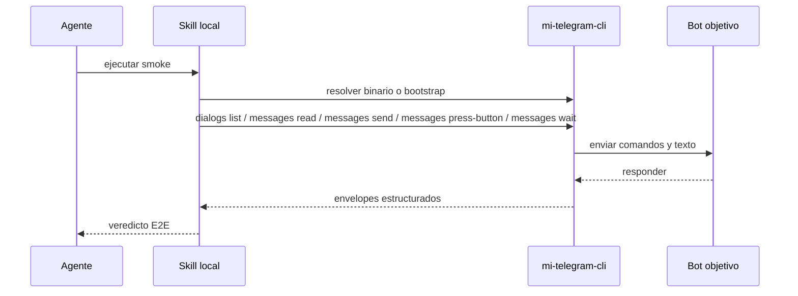

# FL-SKL-01 - Ejecutar smoke E2E desde una skill

## 1. Goal

Permitir que una skill de Codex o Claude Code orqueste un smoke E2E real usando el CLI y una cuenta Telegram dedicada.

## 2. Scope in/out

- In: invocación shell-driven del CLI y consumo de salida estructurada.
- Out: skill con lógica Telegram propia fuera del binario.

## 3. Actors and ownership

| Actor | Ownership |
| --- | --- |
| Agente | Orquesta el smoke y evalúa resultados. |
| Skill local | Encadena comandos del CLI. |
| CLI | Ejecuta operaciones Telegram y devuelve evidencia estructurada. |
| Bot objetivo | Responde al flujo conversacional. |

## 4. Preconditions

- Perfil autorizado disponible.
- Peer del bot resoluble.
- Existe un caso E2E preparado, por ejemplo un `pairingCode`.
- El binario `mi-telegram-cli` es invocable por `PATH`, ruta absoluta conocida o bootstrap desde el repo fuente.
- Si la ejecución ocurre en Windows, la skill dispone de `pwsh` para wrappers locales o handoff interactivo visible; no asume `powershell.exe` en `PATH`.
- Si el peer objetivo se expresa como `@username`, la skill lo pasa quoted en PowerShell para preservar el valor literal.
- Si el smoke es cruzado entre cuentas, existe un segundo perfil dedicado y autorizado.

## 5. Postconditions

- La skill obtiene evidencia suficiente para concluir éxito o falla del smoke.

## 6. Main sequence

## 7. Alternative/error path

| Caso | Resultado |
| --- | --- |
| Binario fuera de PATH | La skill intenta ruta conocida o bootstrap antes de fallar |
| Perfil no autorizado | La skill falla temprano |
| Peer no resuelto | La skill aborta con error accionable |
| Timeout de reply | La skill reporta falla de smoke |
| Perfil ocupado por otra operación | La skill usa cola FIFO por perfil o devuelve un fallo accionable por `QueueTimeout` |
| Login interactivo necesita una terminal visible | La skill delega un comando local al operador antes de continuar |
| Host Windows sin `powershell.exe` utilizable | La skill usa `pwsh` o un comando local equivalente |

## 8. Architecture slice

Skill local + CLI + Adaptador Telegram.

## 9. Data touchpoints

- `PerfilLocal`
- `PeerObjetivo`
- `MensajeResumen`

## 10. Candidate RF references

- `RF-SKL-001`

## 11. Bottlenecks, risks, and selected mitigations

| Riesgo | Mitigacion |
| --- | --- |
| La skill duplique reglas del CLI | Toda lógica Telegram vive en el binario. |
| Resultado difícil de consumir | Envelope estable `ok/profile/data/error`. |
| Uso desde repos consumidores | La skill no asume `tmp/smoke-*` ni el repo fuente como workspace activo. |
| El smoke requiera botones inline | La skill inspecciona `buttons[]` y usa `messages press-button` con selector explícito. |
| `@peer` mal interpretado por PowerShell | La skill quotea peers `@...` antes de invocar el CLI. |
| `QueueTimeout` por concurrencia sostenida | La cola FIFO no llegó a ejecutar dentro del presupuesto configurado. |
| Login interactivo no visible desde una terminal lanzada por el agente | La skill usa handoff local con `pwsh -File ...` o un comando directo del CLI. |
| Smoke cruzado entre dos cuentas | Se usa una cuenta dedicada por perfil y se correlaciona el intercambio con un token compartido. |

## 12. RF handoff checklist

| Check | Estado |
| --- | --- |
| Ownership cerrado | Yes |
| Estados clave identificados | Yes |
| Variantes críticas identificadas | Yes |
| Riesgos dominantes documentados | Yes |
